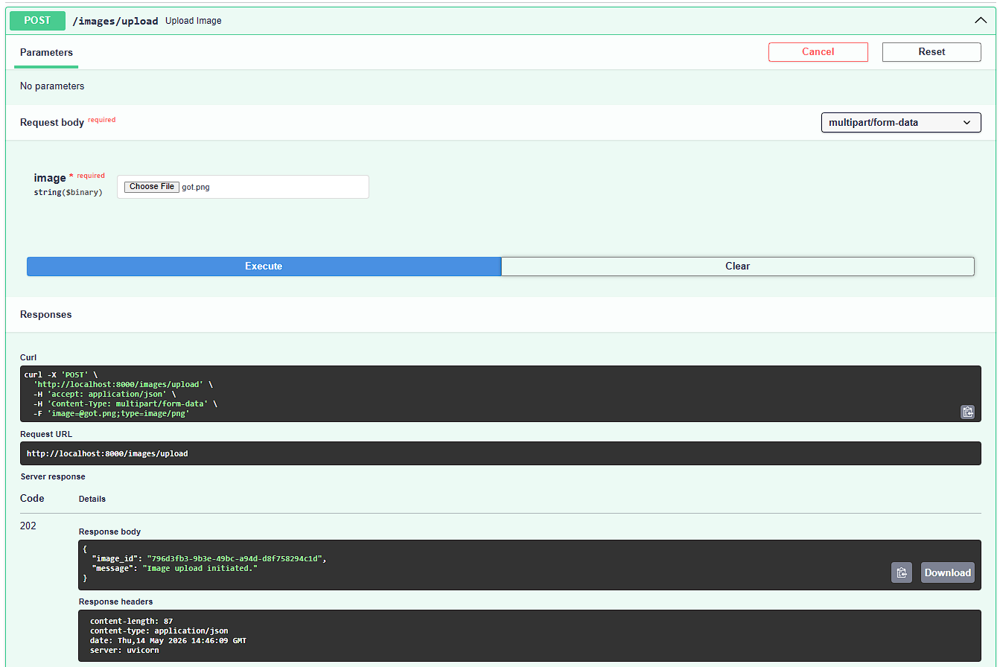
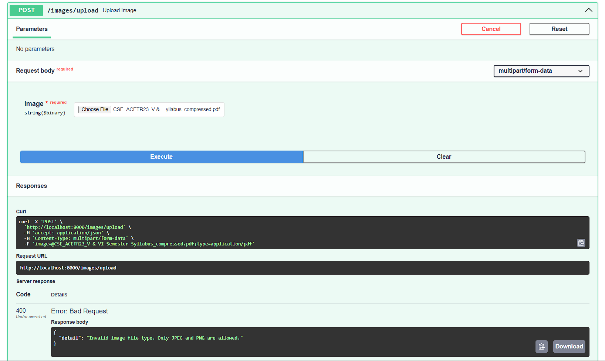
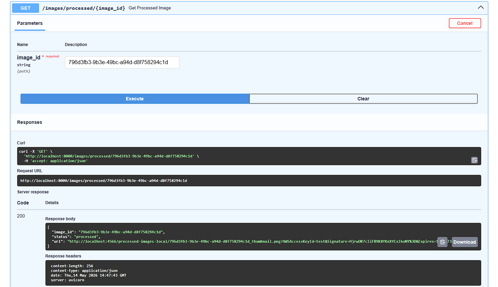
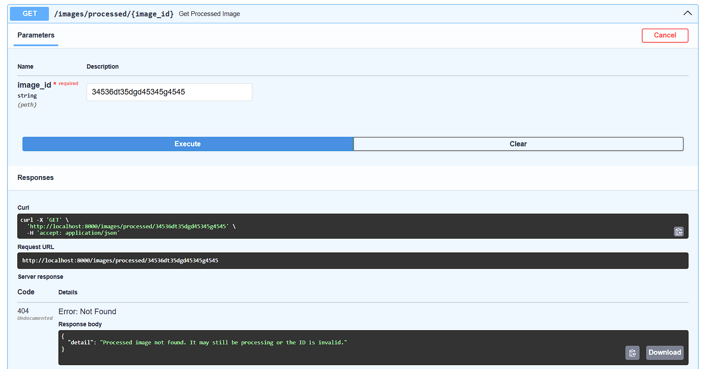

# Asynchronous Image Processing Pipeline

A robust, event-driven backend service that asynchronously processes user-uploaded images. Built with **FastAPI**, **Python**, and simulated AWS services (S3 and SQS) via **LocalStack**.

---

## 🚀 Local Development Setup

### Prerequisites

- Docker
- Docker Compose

### Quickstart

1. Clone this repository.
   ```bash
   git clone https://github.com/Ravindra-Reddy27/Asynchronous-Image-Processing-Pipeline.git
   cd Asynchronous-Image-Processing-Pipeline
    ```

2. Copy the example environment file:

   ```bash
   cp .env.example .env
   ```

3. Build and start the infrastructure (API, Worker, and LocalStack):
   ```bash
   docker-compose up --build -d
   ```

> **Note:** The LocalStack container runs a setup script automatically to provision the S3 buckets and SQS queues.

---

## 📚 API Reference

The API will be available at: http://localhost:8000

Interactive API Docs (Swagger): http://localhost:8000/docs

### 1. Upload an Image

| Property | Value |
|---|---|
| **URL** | `/images/upload` |
| **Method** | `POST` |
| **Body** | `multipart/form-data` — Key: `image`, Value: Valid JPG/PNG file |

**Success Response:**

- **Code:** `202 ACCEPTED`
- **Content:**
  ```json
  {
    "image_id": "uuid",
    "message": "Image upload initiated."
  }
  ```
**Error Response:**

- **Code:** `400 Bad Request`
- **Content:**
  ```json
  {
  "detail": "Invalid image file type. Only JPEG and PNG are allowed."
  }
  ```
---

### 2. Retrieve Processed Image

| Property | Value |
|---|---|
| **URL** | `/images/processed/{image_id}` |
| **Method** | `GET` |

**Success Response:**

- **Code:** `200 OK`
- **Content:**
  ```json
  {
    "image_id": "uuid",
    "status": "processed",
    "url": "http://localhost:4566/..."
  }
  ```
**Error Response:**

- **Code:** `404 Not Found`
- **Content:**
  ```json
  {
  "detail": "Processed image not found. It may still be processing or the ID is invalid."
  }
  ```


---


## 🧪 Running Tests
 
Automated tests are executed directly inside the Docker containers to ensure they interact correctly with the LocalStack environment.
 
### 1. Run API Tests (Validation, Uploads, Retrievals)
 
Keep your containers running, open a new terminal, and execute:
 
```bash
docker-compose exec api-service python -m pytest tests/
```
 
---
 
### 2. Run Worker Tests (Mocked S3/SQS and Image Processing)
 
```bash
docker-compose exec worker-service python -m pytest tests/
```
 
---

## 🏗️ Architecture Overview

This system utilizes a decoupled, asynchronous architecture to ensure the main API remains fast, responsive, and resilient under load.

* **Producer (API Service):** A FastAPI application that receives image uploads, stores the raw files in an S3 bucket, and immediately publishes a processing task to an SQS message queue.
* **Message Broker (AWS SQS):** Manages the asynchronous workflow. It includes a standard processing queue and a Dead-Letter Queue (DLQ) for handling tasks that repeatedly fail.
* **Consumer (Worker Service):** A continuously running Python process that utilizes long-polling to fetch tasks from SQS. It downloads the raw image, resizes it to a maximum of 150x150 pixels (preserving aspect ratio), applies a custom watermark, and uploads the thumbnail to a separate S3 bucket.

### System Diagram


---
##  Demonstration
 
### Successful Upload
 
 
---
 
### Successful Retrieval & Watermark
  
  
  

